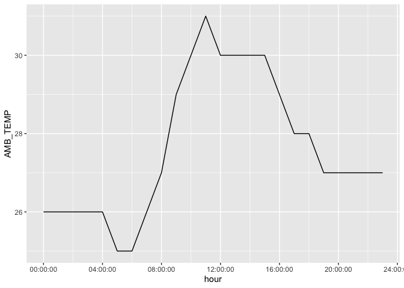

# Assignment_6


## **Exercise 1. Tibble and Data Import**

Import the data frames listed below into R and
[parse](https://r4ds.had.co.nz/data-import.html#parsing-a-vector) the
columns appropriately when needed. Watch out for the formatting oddities
of each dataset. Print the results directly, **without** using
`kable()`.

**You only need to finish any three out of the five questions in this
exercise in order to get credit.**

#### **1.1 Create the following tibble manually, first using `tribble()` and then using `tibble()`. Print both results. \[We didn’t have time to cover this in class, but look up how these functions work [here](https://r4ds.had.co.nz/tibbles.html#creating-tibbles)\]**

``` r
library(tidyverse)
```

    ── Attaching core tidyverse packages ──────────────────────── tidyverse 2.0.0 ──
    ✔ dplyr     1.1.4     ✔ readr     2.1.5
    ✔ forcats   1.0.0     ✔ stringr   1.5.1
    ✔ ggplot2   3.5.2     ✔ tibble    3.3.0
    ✔ lubridate 1.9.4     ✔ tidyr     1.3.1
    ✔ purrr     1.1.0     
    ── Conflicts ────────────────────────────────────────── tidyverse_conflicts() ──
    ✖ dplyr::filter() masks stats::filter()
    ✖ dplyr::lag()    masks stats::lag()
    ℹ Use the conflicted package (<http://conflicted.r-lib.org/>) to force all conflicts to become errors

``` r
library(knitr)
library(janitor)
```


    Attaching package: 'janitor'

    The following objects are masked from 'package:stats':

        chisq.test, fisher.test

``` r
tribble(
  ~a, ~b, ~c,
  #--#--#---
  1, 2.1, "apple",
  2, 3.2, "orange"
) |> 
  print()
```

    # A tibble: 2 × 3
          a     b c     
      <dbl> <dbl> <chr> 
    1     1   2.1 apple 
    2     2   3.2 orange

``` r
## # A tibble: 2 × 3
##       a     b c     
##   <dbl> <dbl> <chr> 
## 1     1   2.1 apple 
## 2     2   3.2 orange


tibble(
  a = 1, 2,
  b = 2.1, 3.2,
  c = "apple", "orange"
) |> 
  print()
```

    # A tibble: 1 × 6
          a   `2`     b `3.2` c     `"orange"`
      <dbl> <dbl> <dbl> <dbl> <chr> <chr>     
    1     1     2   2.1   3.2 apple orange    

``` r
## # A tibble: 2 × 3
##       a     b c     
##   <int> <dbl> <chr> 
## 1     1   2.1 apple 
## 2     2   3.2 orange
```

#### **1.2 Import `https://raw.githubusercontent.com/nt246/NTRES-6100-data-science/master/datasets/dataset2.txt` into R. Change the column names into “Name”, “Weight”, “Price”.**

``` r
dataset2 <- read_csv("https://raw.githubusercontent.com/nt246/NTRES-6100-data-science/master/datasets/dataset2.txt", col_names = FALSE)
```

    Rows: 3 Columns: 3
    ── Column specification ────────────────────────────────────────────────────────
    Delimiter: ","
    chr (1): X1
    dbl (2): X2, X3

    ℹ Use `spec()` to retrieve the full column specification for this data.
    ℹ Specify the column types or set `show_col_types = FALSE` to quiet this message.

``` r
dataset2 |> 
  rename(
    Name = X1,
    Weight = X2,
    Price = X3
  ) |> 
  print()
```

    # A tibble: 3 × 3
      Name   Weight Price
      <chr>   <dbl> <dbl>
    1 apple       1   2.9
    2 orange      2   4.9
    3 durian     10  19.9

#### **1.3 Import `https://raw.githubusercontent.com/nt246/NTRES-6100-data-science/master/datasets/dataset3.txt` into R. Watch out for the first few lines, missing values, separators, quotation marks, and deliminaters.**

``` r
read_delim(
  "https://raw.githubusercontent.com/nt246/NTRES-6100-data-science/master/datasets/dataset3.txt",
  skip = 2, 
  col_names = TRUE,
  na = c("?", "Not Available"),
  ) |> 
  clean_names() |> 
  mutate(name = str_replace_all(name, "/", "")) |> 
  print()
```

    Rows: 3 Columns: 3
    ── Column specification ────────────────────────────────────────────────────────
    Delimiter: ";"
    chr (1): /Name/
    dbl (2): /Weight/, /Price/

    ℹ Use `spec()` to retrieve the full column specification for this data.
    ℹ Specify the column types or set `show_col_types = FALSE` to quiet this message.

    # A tibble: 3 × 3
      name   weight price
      <chr>   <dbl> <dbl>
    1 apple       1   2.9
    2 orange      2  NA  
    3 durian     NA  19.9

#### **1.4 Import `https://raw.githubusercontent.com/nt246/NTRES-6100-data-science/master/datasets/dataset4.txt` into R. Watch out for comments, units, and decimal marks (which are `,` in this case).**

``` r
clean_data <- read_delim(
  "https://raw.githubusercontent.com/nt246/NTRES-6100-data-science/master/datasets/dataset4.txt",
  locale = locale(decimal_mark = ","),
  comment = "/"
  ) 
```

    Warning: One or more parsing issues, call `problems()` on your data frame for details,
    e.g.:
      dat <- vroom(...)
      problems(dat)

    Rows: 3 Columns: 3
    ── Column specification ────────────────────────────────────────────────────────
    Delimiter: " "
    chr (3): Name, Weight, Price

    ℹ Use `spec()` to retrieve the full column specification for this data.
    ℹ Specify the column types or set `show_col_types = FALSE` to quiet this message.

``` r
cleaner_data <- clean_data |> 
  mutate(
    Weight = str_remove_all(Weight, "kg"),
    Price = str_remove_all(Price, "€")
  ) 

cleaner_data
```

    # A tibble: 3 × 3
      Name   Weight Price 
      <chr>  <chr>  <chr> 
    1 apple  1      "2,9 "
    2 orange 2      "4,9" 
    3 durian 10     "19,9"

## **Exercise 2. Weather station**

This dataset contains the weather and air quality data collected by a
weather station in Taiwan. It was obtained from the Environmental
Protection Administration, Executive Yuan, R.O.C. (Taiwan).

#### **2.1 Variable descriptions**

- The text file
  `https://raw.githubusercontent.com/nt246/NTRES-6100-data-science/master/datasets/2015y_Weather_Station_notes.txt`
  contains descriptions of different variables collected by the station.

- Import it into R and print it in a table as shown below with
  `kable()`.

``` r
read_delim(
  "https://raw.githubusercontent.com/nt246/NTRES-6100-data-science/master/datasets/2015y_Weather_Station_notes.txt",
  delim = "-") |> 
  kable()
```

    Rows: 15 Columns: 3
    ── Column specification ────────────────────────────────────────────────────────
    Delimiter: "-"
    chr (3): Item, Unit, Description

    ℹ Use `spec()` to retrieve the full column specification for this data.
    ℹ Specify the column types or set `show_col_types = FALSE` to quiet this message.

| Item | Unit | Description |
|:---|:---|:---|
| AMB_TEMP | Celsius | Ambient air temperature |
| CO | ppm | Carbon monoxide |
| NO | ppb | Nitric oxide |
| NO2 | ppb | Nitrogen dioxide |
| NOx | ppb | Nitrogen oxides |
| O3 | ppb | Ozone |
| PM10 | μg/m3 | Particulate matter with a diameter between 2.5 and 10 μm |
| PM2.5 | μg/m3 | Particulate matter with a diameter of 2.5 μm or less |
| RAINFALL | mm | Rainfall |
| RH | % | Relative humidity |
| SO2 | ppb | Sulfur dioxide |
| WD_HR | degress | Wind direction (The average of hour) |
| WIND_DIREC | degress | Wind direction (The average of last ten minutes per hour) |
| WIND_SPEED | m/sec | Wind speed (The average of last ten minutes per hour) |
| WS_HR | m/sec | Wind speed (The average of hour) |

#### **2.2 Data tidying**

- Import
  `https://raw.githubusercontent.com/nt246/NTRES-6100-data-science/master/datasets/2015y_Weather_Station.csv`
  into R. As you can see, this dataset is a classic example of untidy
  data: values of a variable (i.e. hour of the day) are stored as column
  names; variable names are stored in the `item` column.

- Clean this dataset up and restructure it into a tidy format.

- Parse the `date` variable into date format and parse `hour` into time.

- Turn all invalid values into `NA` and turn `NR` in rainfall into `0`.

- Parse all values into numbers.

- Show the first 6 rows and 10 columns of this cleaned dataset, as shown
  below, *without* using `kable()`.

*Hints: you don’t have to perform these tasks in the given order; also,
warning messages are not necessarily signs of trouble.*

``` r
weather_raw <- read_delim(
  "https://raw.githubusercontent.com/nt246/NTRES-6100-data-science/master/datasets/2015y_Weather_Station.csv", na = c("","NA"), col_types = cols(.default = "c")
  ) 

weather_longer <- weather_raw |> 
  pivot_longer(
    cols = matches("^\\d{2}$"), 
    names_to = "hour", 
    values_to = "value"
    ) |> 
  pivot_wider(values_from = value, names_from = item)

weather_clean <- weather_longer |> 
  mutate(
    date = parse_date(date, format = "%Y/%m/%d"),
    hour = parse_time(hour, format = "%H")
  ) |> 
  # Turn all invalid values into NA and turn NR in rainfall into 0
  mutate(
    RAINFALL = ifelse(RAINFALL == "NR", "0", RAINFALL)
  ) |> 
  # Parse all values into numbers
  mutate(across(
    .cols = c(AMB_TEMP:WS_HR),
    .fns = ~as.numeric(.)
    )) 
```

    Warning: There were 15 warnings in `mutate()`.
    The first warning was:
    ℹ In argument: `across(.cols = c(AMB_TEMP:WS_HR), .fns = ~as.numeric(.))`.
    Caused by warning:
    ! NAs introduced by coercion
    ℹ Run `dplyr::last_dplyr_warnings()` to see the 14 remaining warnings.

``` r
# Show the first 6 rows and 10 columns of this weather_clean without using `kable()`
weather_clean |> 
  select(1:10) |> 
  print(n = 6)
```

    # A tibble: 8,736 × 10
      date       station hour   AMB_TEMP    CO    NO   NO2   NOx    O3  PM10
      <date>     <chr>   <time>    <dbl> <dbl> <dbl> <dbl> <dbl> <dbl> <dbl>
    1 2015-01-01 Cailiao 00:00        16  0.74   1      15    16    35   171
    2 2015-01-01 Cailiao 01:00        16  0.7    0.8    13    14    36   174
    3 2015-01-01 Cailiao 02:00        15  0.66   1.1    13    14    35   160
    4 2015-01-01 Cailiao 03:00        15  0.61   1.7    12    13    34   142
    5 2015-01-01 Cailiao 04:00        15  0.51   2      11    13    34   123
    6 2015-01-01 Cailiao 05:00        14  0.51   1.7    13    15    32   110
    # ℹ 8,730 more rows

#### **2.3 Using this cleaned dataset, plot the daily variation in ambient temperature on September 25, 2015, as shown below.**

``` r
weather_clean |> 
  filter(date == "2015/09/25") |> 
  ggplot(aes(x = hour, y = AMB_TEMP)) +
           geom_path()
```



#### **2.4 Plot the daily average ambient temperature throughout the year with a continuous line, as shown below.**

``` r
weather_clean |> 
  group_by(date) |> 
  summarise(daily_average_ambient_temp = mean(AMB_TEMP, na.rm = TRUE)) |> 
  ggplot(aes(x = date, y = daily_average_ambient_temp)) +
           geom_path()
```


#### **2.5 Plot the total rainfall per month in a bar chart, as shown below.**

*Hint: separating date into three columns might be helpful.*

``` r
weather_clean |> 
  replace_na(list(RAINFALL = 0)) |> 
  separate(date, into = c("Year", "Month", "Day"), sep = "-") |> 
  group_by(Month) |> 
  summarize(monthly_rainfall = sum(RAINFALL)) |> 
  ggplot(aes(x = Month, y = monthly_rainfall)) + 
  geom_col()
```


#### **2.6 Plot the daily average ambient temperature throughout the year with a continuous line, as shown below.**

``` r
unite(weather_clean, time, date, hour, sep=" ") |> 
  mutate(time = parse_datetime(time)) |> 
  filter(time<=parse_datetime("2015-09-08"), time>=parse_datetime("2015-09-01"), !is.na(PM2.5))  |> 
  ggplot(aes(x=time, y=PM2.5))+
  geom_line()
```


#### 
