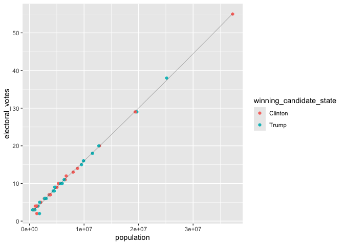
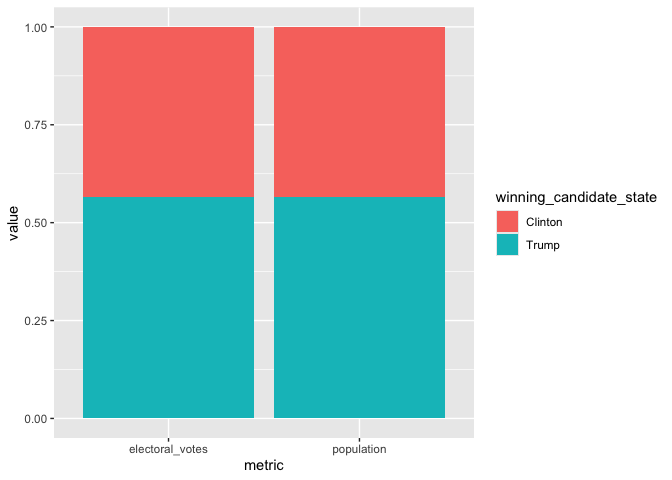
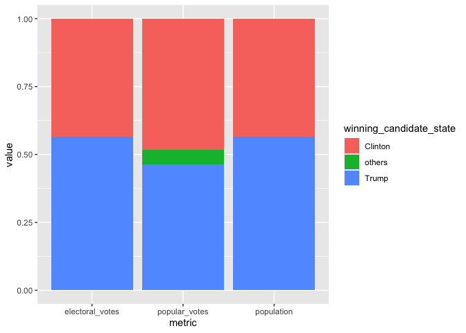
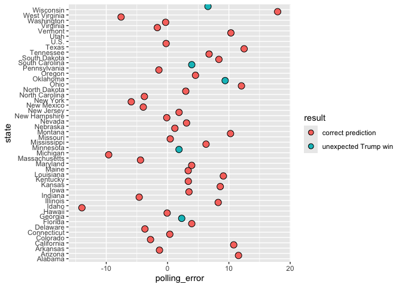

# Assignment_7


``` r
library(tidyverse)
```

    ── Attaching core tidyverse packages ──────────────────────── tidyverse 2.0.0 ──
    ✔ dplyr     1.1.4     ✔ readr     2.1.5
    ✔ forcats   1.0.0     ✔ stringr   1.5.1
    ✔ ggplot2   3.5.2     ✔ tibble    3.3.0
    ✔ lubridate 1.9.4     ✔ tidyr     1.3.1
    ✔ purrr     1.1.0     
    ── Conflicts ────────────────────────────────────────── tidyverse_conflicts() ──
    ✖ dplyr::filter() masks stats::filter()
    ✖ dplyr::lag()    masks stats::lag()
    ℹ Use the conflicted package (<http://conflicted.r-lib.org/>) to force all conflicts to become errors

``` r
library(knitr)
library(dslabs)
```

## **Exercise: 2016 election result and polling**

For this exercise, we will explore the result of the 2016 US
presidential election as well as the polling data. We will use the
following three datasets in the `dslabs` package, and use `join`
function to connect them together. As a reminder, you can use `?` to
learn more about these datasets.

- `results_us_election_2016`: Election results (popular vote) and
  electoral college votes from the 2016 presidential election.

- `polls_us_election_2016`: Poll results from the 2016 presidential
  elections.

- `murders`: Gun murder data from FBI reports. It also contains the
  population of each state.

We will also use [this
dataset](https://raw.githubusercontent.com/kshaffer/election2016/master/2016ElectionResultsByState.csv)
to get the exact numbers of votes for question 3.

### **Question 1. What is the relationship between the population size and the number of electoral votes each state has?**

**1a.** Use a `join` function to combine the `murders` dataset, which
contains information on population size, and the
`results_us_election_2016` dataset, which contains information on the
number of electoral votes. Name this new dataset `q_1a`, and show its
first 6 rows.

``` r
q_1a <- murders |> 
  left_join(results_us_election_2016) 
```

    Joining with `by = join_by(state)`

``` r
q_1a |> 
  head(6) |> 
  kable()
```

| state | abb | region | population | total | electoral_votes | clinton | trump | johnson | stein | mcmullin | others |
|:---|:---|:---|---:|---:|---:|---:|---:|---:|---:|---:|---:|
| Alabama | AL | South | 4779736 | 135 | 9 | 34.35795 | 62.08309 | 2.094169 | 0.4422682 | 0.0000000 | 1.0225246 |
| Alaska | AK | West | 710231 | 19 | 3 | 36.55087 | 51.28151 | 5.877128 | 1.8000176 | 0.0000000 | 4.4904710 |
| Arizona | AZ | West | 6392017 | 232 | 11 | 44.58042 | 48.08314 | 4.082188 | 1.3185997 | 0.6699155 | 1.2657329 |
| Arkansas | AR | South | 2915918 | 93 | 6 | 33.65190 | 60.57191 | 2.648769 | 0.8378174 | 1.1653206 | 1.1242832 |
| California | CA | West | 37253956 | 1257 | 55 | 61.72640 | 31.61711 | 3.374092 | 1.9649200 | 0.2792070 | 1.0382753 |
| Colorado | CO | West | 5029196 | 65 | 9 | 48.15651 | 43.25098 | 5.183748 | 1.3825031 | 1.0400874 | 0.9861714 |

**1b.** Add a new variable in the `q_1a` dataset to indicate which
candidate won in each state, and remove the columns `abb`, `region`, and
`total`. Name this new dataset `q_1b`, and show its first 6 rows.

``` r
# Add a new variable in the `q_1a` dataset to indicate which candidate won in each state, and remove the columns `abb`, `region`, and `total`. Name this new dataset `q_1b`, and show its first 6 rows. 

q_1b <- q_1a |> 
  select(-abb, -region, -total) |> 
  mutate(winning_candidate_state = ifelse(clinton > trump, "Clinton", "Trump"))
  
q_1b |> 
  head(6) |>
  kable()
```

| state | population | electoral_votes | clinton | trump | johnson | stein | mcmullin | others | winning_candidate_state |
|:---|---:|---:|---:|---:|---:|---:|---:|---:|:---|
| Alabama | 4779736 | 9 | 34.35795 | 62.08309 | 2.094169 | 0.4422682 | 0.0000000 | 1.0225246 | Trump |
| Alaska | 710231 | 3 | 36.55087 | 51.28151 | 5.877128 | 1.8000176 | 0.0000000 | 4.4904710 | Trump |
| Arizona | 6392017 | 11 | 44.58042 | 48.08314 | 4.082188 | 1.3185997 | 0.6699155 | 1.2657329 | Trump |
| Arkansas | 2915918 | 6 | 33.65190 | 60.57191 | 2.648769 | 0.8378174 | 1.1653206 | 1.1242832 | Trump |
| California | 37253956 | 55 | 61.72640 | 31.61711 | 3.374092 | 1.9649200 | 0.2792070 | 1.0382753 | Clinton |
| Colorado | 5029196 | 9 | 48.15651 | 43.25098 | 5.183748 | 1.3825031 | 1.0400874 | 0.9861714 | Clinton |

**1c.** Using the `q_1b` dataset, plot the relationship between
population size and number of electoral votes. Use color to indicate who
won the state. Fit a straight line to the data, set its color to black,
size to 0.1, and turn off its confidence interval.

``` r
q_1b |> 
  ggplot(aes(x = population, y = electoral_votes)) +
  geom_point(aes(color = winning_candidate_state)) +
  geom_smooth(color = "black", se = FALSE, size = .1)
```

    Warning: Using `size` aesthetic for lines was deprecated in ggplot2 3.4.0.
    ℹ Please use `linewidth` instead.

    `geom_smooth()` using method = 'loess' and formula = 'y ~ x'



### **Question 2. Would the election result be any different if the number of electoral votes is exactly proportional to a state’s population size?**

**2a.** First, convert the `q_1b` dataset to longer format such that the
`population` and `electoral_votes` columns are turned into rows as shown
below. Name this new dataset `q_2a`, and show its first 6 rows.

``` r
q_2a <- q_1b |> 
  pivot_longer(cols = c(population, electoral_votes), 
               names_to = "metric", 
               values_to = "value") 

q_2a|> 
  head(6) |> 
  kable()
```

| state | clinton | trump | johnson | stein | mcmullin | others | winning_candidate_state | metric | value |
|:---|---:|---:|---:|---:|---:|---:|:---|:---|---:|
| Alabama | 34.35795 | 62.08309 | 2.094169 | 0.4422682 | 0.0000000 | 1.022525 | Trump | population | 4779736 |
| Alabama | 34.35795 | 62.08309 | 2.094169 | 0.4422682 | 0.0000000 | 1.022525 | Trump | electoral_votes | 9 |
| Alaska | 36.55087 | 51.28151 | 5.877128 | 1.8000176 | 0.0000000 | 4.490471 | Trump | population | 710231 |
| Alaska | 36.55087 | 51.28151 | 5.877128 | 1.8000176 | 0.0000000 | 4.490471 | Trump | electoral_votes | 3 |
| Arizona | 44.58042 | 48.08314 | 4.082188 | 1.3185997 | 0.6699155 | 1.265733 | Trump | population | 6392017 |
| Arizona | 44.58042 | 48.08314 | 4.082188 | 1.3185997 | 0.6699155 | 1.265733 | Trump | electoral_votes | 11 |

**2b.** Then, sum up the number of electoral votes and population size
across all states for each candidate. Name this new dataset `q_2b`, and
print it as shown below.

``` r
q_2b <- q_2a |> 
  group_by(metric, winning_candidate_state) |> 
  summarize(value = sum(value)) 
```

    `summarise()` has grouped output by 'metric'. You can override using the
    `.groups` argument.

``` r
q_2b|> 
  kable()
```

| metric          | winning_candidate_state |     value |
|:----------------|:------------------------|----------:|
| electoral_votes | Clinton                 |       231 |
| electoral_votes | Trump                   |       302 |
| population      | Clinton                 | 134982448 |
| population      | Trump                   | 174881780 |

``` r
# Then, sum up the number of electoral votes and population size across all states for each candidate. Name this new dataset q_2b, and print it as shown below.
```

**2c.** Use the `q_2b` dataset to contruct a bar plot to show the final
electoral vote share under the scenarios of **1)** each state has the
number of electoral votes that it currently has, and **2)** each state
has the number of electoral votes that is exactly proportional to its
population size. Here, assume that for each state, the winner will take
all its electoral votes.

*Hint: `geom_col(position = "fill")` might be helpful.*

``` r
q_2b |> 
  ggplot(aes(x = metric, y = value, fill = winning_candidate_state)) +
  geom_col(position = "fill")
```



### **Question 3. What if the election was determined by popular votes?**

**3a.** First, from [this dataset on
GitHub](https://raw.githubusercontent.com/kshaffer/election2016/master/2016ElectionResultsByState.csv),
calculate the number of popular votes each candidate received as shown
below. Name this new dataset `q_3a`, and print it.

*Note: Vote counts are listed for several other candidates. Please
combine the votes for all candidates other than Clinton and Trump into a
single `others` category (as shown in the table below)*

*Hint: `pivot_longer()` may be useful in here.*

``` r
election_raw <- read.csv("https://raw.githubusercontent.com/kshaffer/election2016/master/2016ElectionResultsByState.csv")

q_3a = NULL

q_3a <-  election_raw |> 
  mutate(others = rowSums(across(johnsonVotes:othersVotes))) |> 
  select(state, clintonVotes, trumpVotes, others) |> 
  rename(Clinton = clintonVotes, Trump = trumpVotes) |>
  pivot_longer(
    cols = c(Clinton, Trump, others),
    names_to = "winning_candidate_state",
    values_to = "value"
  ) |> 
  group_by(winning_candidate_state) |> 
  summarize(value = sum(value)) |> 
  mutate(metric = "popular_votes") |> 
  relocate(metric, .before = 1)


q_3a |> 
  kable()
```

| metric        | winning_candidate_state |    value |
|:--------------|:------------------------|---------:|
| popular_votes | Clinton                 | 65125640 |
| popular_votes | Trump                   | 62616675 |
| popular_votes | others                  |  7054974 |

**3b.** Combine the `q_2b` dataset with the `q_3a` dataset. Call this
new dataset `q_3b`, and print it as shown below.

``` r
q_3b <- q_2b |> 
  bind_rows(q_3a)

q_3b |> 
  kable()
```

| metric          | winning_candidate_state |     value |
|:----------------|:------------------------|----------:|
| electoral_votes | Clinton                 |       231 |
| electoral_votes | Trump                   |       302 |
| population      | Clinton                 | 134982448 |
| population      | Trump                   | 174881780 |
| popular_votes   | Clinton                 |  65125640 |
| popular_votes   | Trump                   |  62616675 |
| popular_votes   | others                  |   7054974 |

**3c.** Lastly, use the `q_3b` dataset to contruct a bar plot to show
the final vote share under the scenarios of **1)** each state has the
number of electoral votes that it currently has, **2)** each state has
the number of electoral votes that is exactly proportional to its
population size, and **3)** the election result is determined by the
popular vote.

``` r
q_3b |> 
   ggplot(aes(x = metric, y = value, fill = winning_candidate_state)) +
  geom_col(position = "fill")
```



### **Question 4. The election result in 2016 came as a huge surprise to many people, especially given that most polls predicted Clinton would win before the election. Where did the polls get wrong?**

**4a.** The polling data is stored in the data frame
`polls_us_election_2016`. For the sake of simplicity, we will only look
at the data from a single poll for each state. Subset the polling data
to include only the results from the pollster `Ipsos`. Exclude national
polls, and for each state, select the polling result with the `enddate`
closest to the election day (i.e. those with the lastest end date). Keep
only the columns `state`, `adjpoll_clinton`, and `adjpoll_trump`. Save
this new dataset as `q_4a`, and show its first 6 rows.

*Note: You should have 47 rows in `q_4a` because only 47 states were
polled at least once by Ipsos. You don’t need to worry about the 3
missing states and DC.*

*Hint: `group_by()` and `slice_max()` can be useful for this question.
Check out the help file for `slice_max()` for more info.*

``` r
q_4a <- polls_us_election_2016 |> 
  filter(pollster == "Ipsos") |> 
  group_by(state) |> 
  filter(enddate == max(enddate)) |> 
  select(state, adjpoll_clinton, adjpoll_trump) |> 
  arrange(state)

q_4a |> 
  head(6) |> 
  kable()
```

| state       | adjpoll_clinton | adjpoll_trump |
|:------------|----------------:|--------------:|
| Alabama     |        37.54023 |      53.69718 |
| Arizona     |        41.35774 |      46.17779 |
| Arkansas    |        37.15339 |      53.28384 |
| California  |        58.33806 |      31.00473 |
| Colorado    |        46.00764 |      40.73571 |
| Connecticut |        48.81810 |      38.87069 |

**4b.** Combine the `q_4a` dataset with the `q_1b` dataset with a `join`
function. The resulting dataset should only have 47 rows. Create the
following new variables in this joined dataset.

- `polling_margin`: difference between `adjpoll_clinton` and
  `adjpoll_trump`

- `actual_margin`: difference between `clinton` and `trump`

- `polling_error`: difference between `polling_margin` and
  `actual_margin`

- `predicted_winner`: predicted winner based on `adjpoll_clinton` and
  `adjpoll_trump`

- `result = ifelse(winner == predicted_winner, "correct prediction", str_c("unexpected ", winner, " win"))`

Keep only the columns `state`, `polling_error`, `result`,
`electoral_votes`. Name the new dataset `q_4b` and show its first 6
rows.

``` r
q_4b <- q_4a |> 
  left_join(q_1b) |> 
  mutate(
    polling_margin = (adjpoll_clinton - adjpoll_trump),
    actual_margin = (clinton - trump),
    polling_error = polling_margin - actual_margin,
    predicted_winner = ifelse(adjpoll_clinton > adjpoll_trump, "Clinton", "Trump"),
    result = ifelse(winning_candidate_state == predicted_winner, "correct prediction", str_c("unexpected ", winning_candidate_state, " win"))) |> 
  select(state, polling_error, result, electoral_votes)
```

    Joining with `by = join_by(state)`

``` r
q_4b |> 
  head(6) |> 
  kable()
```

| state       | polling_error | result             | electoral_votes |
|:------------|--------------:|:-------------------|----------------:|
| Alabama     |    11.5681966 | correct prediction |               9 |
| Arizona     |    -1.3173239 | correct prediction |              11 |
| Arkansas    |    10.7895518 | correct prediction |               6 |
| California  |    -2.7759631 | correct prediction |              55 |
| Colorado    |     0.3663946 | correct prediction |               9 |
| Connecticut |    -3.6919767 | correct prediction |               7 |

**4c.** Generate the following plot with the `q_4b` dataset. Use chunk
options to adjust the dimensions of the plot to make it longer than the
default dimension. Based on this plot, where did the polls get wrong in
the 2016 election?

``` r
q_4b |> 
  ggplot(aes(x = polling_error, y = state, fill = result), dotsize = electoral_votes) +
  geom_dotplot()
```

    Bin width defaults to 1/30 of the range of the data. Pick better value with
    `binwidth`.

    Warning: Removed 1 row containing missing values or values outside the scale range
    (`stat_bindot()`).


